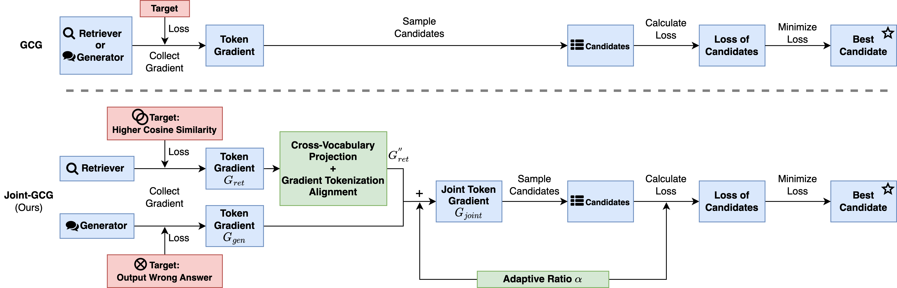

# Joint-GCG: Unified Gradient-Based Poisoning Attacks on Retrieval-Augmented Generation Systems

[Homepage](https://nicerwang.github.io/Joint-GCG/) | [Paper Here](https://arxiv.org/abs/2506.06151)

This repository contains the official implementation of the paper, "**Joint-GCG: Unified Gradient-Based Poisoning Attacks on Retrieval-Augmented Generation Systems**". The paper proposed **Joint-GCG**, a novel framework that unifies gradient-based poisoning against RAG systems by jointly optimizing for retriever and generator, compelling them to produce malicious outputs with substantially higher success rates (on average 5%, up to 25% over prior methods) and unprecedented transferability to other models.



## Key Components

* Implementation of CVP: `core.py#L76`
  * Build Transfer Matrix ($W$ in paper)： see `train_projection_matrices.sh`

* Implementation of GTA: `core.py#L28`

* Implementation of AWF: `utils.py#L28`

## Experiments Script: *.sh 

> Before Run Any Experiments, please fill necessary pathes in `entry_rag.py` and `settings_rag_batch.py`.

* Section 5.2.1: run_base.sh
* Section 5.2.2:
  * CVP + GTA: run_ablation_cvp+gta.sh
  * Retriever-Side Loss: run_ablation_loss.sh
  * AWF: run_ablation_awf.sh

* Section 5.2.3: run_fakecorpus.sh
* Section 5.2.4: run_batch.sh
* Section 5.3.1: See `prompt/rag_prompt.py#L184`
* Section 5.3.2: run_defense_ppl.sh

> For other experiments that do not require optimization, you can modify the `llm_eval_only.py` script, which has already loaded the RAG system we use for you.

## Evaluation

* Once you have tensorboard logs, you can use below notebooks for evaluation: 

  * `notebook/rag_eval.ipynb`

  * `notebook/phantom_eval.ipynb`, where each cluster #{id} refers to the corresponding trigger queries.

## Citation

If you find this work useful, please consider citing the following paper:
```bibtex
@misc{wang2025jointgcgunifiedgradientbasedpoisoning,
      title={Joint-GCG: Unified Gradient-Based Poisoning Attacks on Retrieval-Augmented Generation Systems}, 
      author={Haowei Wang and Rupeng Zhang and Junjie Wang and Mingyang Li and Yuekai Huang and Dandan Wang and Qing Wang},
      year={2025},
      eprint={2506.06151},
      archivePrefix={arXiv},
      primaryClass={cs.CR},
      url={https://arxiv.org/abs/2506.06151}, 
}
```